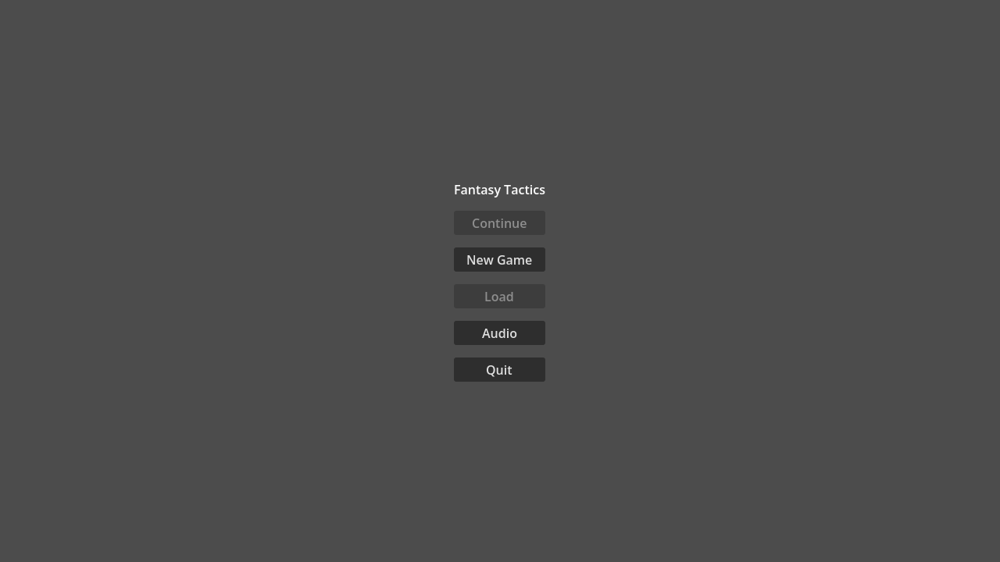
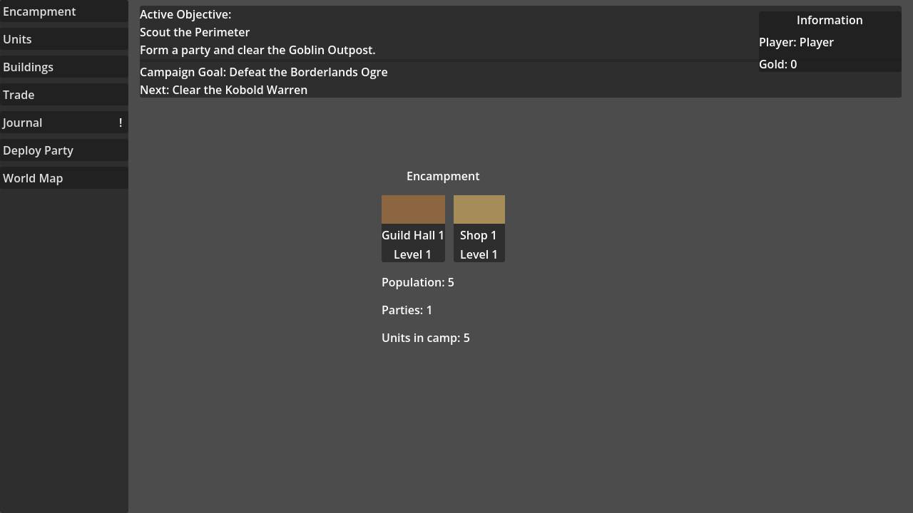
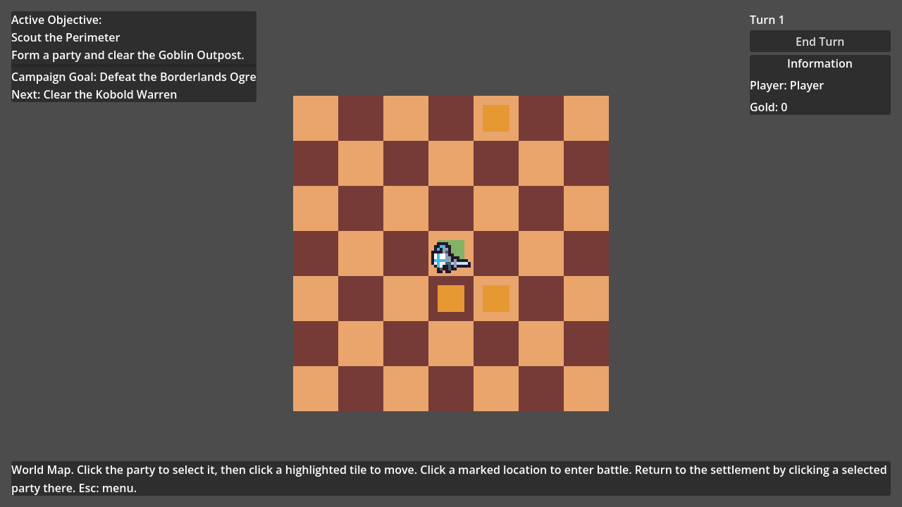
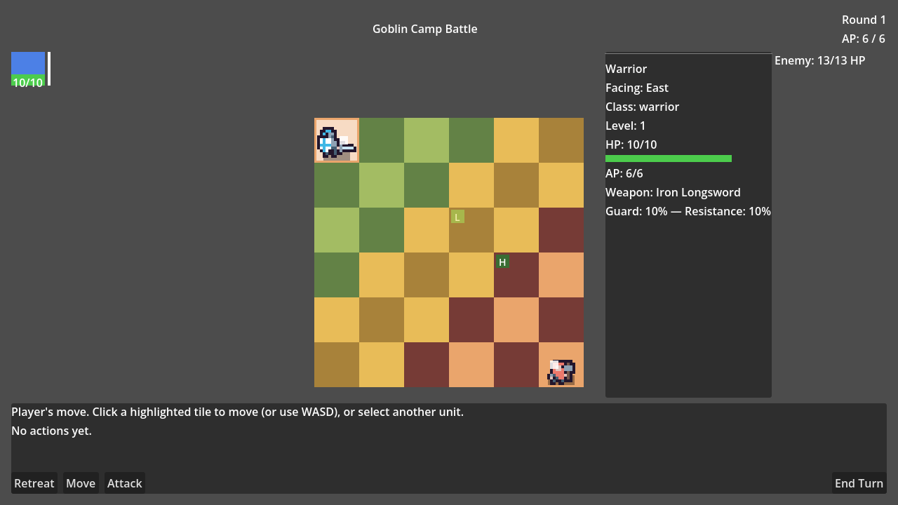

# Fantasy Tactics

A 2D turn-based tactics game built in Godot 4. Recruit and gear up a party
of adventurers at your Encampment, deploy them across a World Map, and
fight grid-based tactical battles against goblins, orcs, kobolds, and a
final boss encounter — all the way through a 12-stage campaign.

|                                    |                                |
|------------------------------------|--------------------------------|
|  |  |
|    |  |

## Running the game

**Prerequisites**

- [Godot 4.7.2](https://godotengine.org/) (stable), available on `PATH` as
  `godot`. Confirm with `godot --version`.

**Steps**

```
git clone <this repo>
cd fantasy-tactics
make play
```

`make play` runs `godot --path .` and opens a window at 1280×720 showing
the Start Menu.

Other useful targets (`make help` lists all of them):

| Command | What it does |
|---|---|
| `make editor` | Open the project in the Godot editor |
| `make test` | Run the automated test suite (GUT) |
| `make screenshots` | Capture a screenshot of every scene/state |

## Documentation

For test suite details, codebase orientation, debug tooling, and everything
else needed to develop the game, start at
[`docs/dev/README.md`](docs/dev/README.md).

## License

[MIT](LICENSE)
