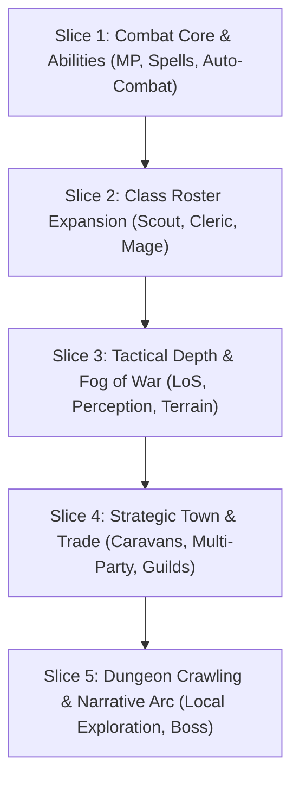

# Design Gap Analysis & Implementation Roadmap

## Overview & Scope

This document provides a comprehensive evaluation of the current implementation of **Fantasy Tactics** against the overall design vision set forth in [`vision.md`](vision.md) and its supporting design specifications ([`class-system.md`](class-system.md), [`equipment-handbook.md`](equipment-handbook.md), [`monster-manual.md`](monster-manual.md), [`movement-and-action-points.md`](movement-and-action-points.md), [`weapon-armor-inventory.md`](weapon-armor-inventory.md), and [`UI-Layout-Design-Guidelines.md`](UI-Layout-Design-Guidelines.md)).

The goal is to clearly document all missing features, architectural gaps, and unfulfilled design intent—with a heavy emphasis on **tactical combat**—and establish an actionable roadmap to achieve the complete design vision.

---

## Executive Summary: Shipped State vs. Vision

| Subsystem | Current Shipped Implementation (`main`) | Target Design Vision ([`vision.md`](vision.md) & specifications) | Gap Severity |
|---|---|---|---|
| **Tactical Combat Grid & AI** | Fixed 6x6 arena grid, 100% full map visibility, manual turn-based combat only. Basic AI (move towards nearest, melee/ranged basic attack). | Fog of war, line-of-sight visual masking, unit Perception attributes, stale tile memory, in-battle AI auto-combat toggle, pre-battle auto-resolve option. | **High** |
| **Classes & Combat Abilities** | Warrior root class only. Basic attack (3 AP), potion use (2 AP), item transfer (2 AP). | 4 Root classes (Warrior, Scout, Cleric, Mage) & 8 Specializations (Knight, Archer, Healer, Paladin, Spellcaster, Battle Mage, Ranger). MP/Piety resources, active spells, AoE, status effects, and active perk abilities. | **High** |
| **RPG Attributes & Perks** | 10 skill points per level into raw Attack (Accuracy). 1 active perk (`bonus_move` +1 AP). | Fallout 1/2 style attributes (STR, AGI, VIT, INT, PIE, LUK), critical hits, dodge, dodge/carry capacity, deep class perk trees with prerequisites. | **Medium** |
| **Dungeon Crawling** | Isolated single-screen 6x6 battle arenas entered directly from World Map encounters. | Local turn-based map exploration before combat, group selection & formation movement (Baldur's Gate / Fallout style), seamless combat entry/exit. | **High** |
| **Monster Roster & Mechanics** | Kobold, Goblin, Goblin Archer, Orc, Hobgoblin. Single-target melee/ranged attacks, basic Thorn Rune paralyze status. | Expanded monster families (Bandits, Skeletons, Wolves, Giant Spiders, Ogres, Wraiths) with pack AI, incorporeal traits, resistance profiles, and debuffs. | **Medium** |
| **Party Management** | Exactly 1 party (`party_001`), up to 5 members, single recruit pool of generic Warriors. | Multiple specialized parties (scouts, dungeon divers, bandit hunters), building-gated class recruitment (Temples, Guilds), party size scaling. | **Medium** |
| **Town Management & Economy** | Workshop building levels (Blacksmith, Alchemy, Runic, Trading Post) gating craft recipes and shop caps. | Card-based town management (Rome: Total War style), trade routes, trading caravans needing guards/patrols, passive town income exceeding adventuring loot over time. | **High** |
| **World Map Exploration** | Fixed 7x7 grid, 100% map visibility, static encounter node respawns. | World Map fog of war, city vision radius upgradeable via Watchtowers, vague intel on distant POIs, roaming monster armies. | **Medium** |
| **Story & Narrative Arc** | 3 static expedition sites, guidance panel UI sequence. | Story arc: land grant -> quelling incursions -> discovering magical dungeon generation source -> final climactic boss battle -> sandbox endgame. | **Medium** |

---

## 1. Tactical Combat Gap Analysis (Detailed Deep Dive)

Combat is the core gameplay pillar of Fantasy Tactics. While the current 6x6 grid foundation (`BattleController`, `GridScript`, `Unit`) successfully implements generic Action Points (6 AP), 1-AP tile movement, 3-AP basic attacks, line-of-sight raycasting, and basic item interactions, significant features from the design docs remain unimplemented.

### 1.1 Fog of War & Perception System
- **Design Vision ([`vision.md#fog-of-war`](vision.md#fog-of-war))**:
  - View on the battlefield must be limited by unit Line of Sight (360-degree).
  - Different units have different **Perception** capabilities, affecting visual range and detection of stealth/hidden units.
  - Map status outside active LoS becomes **stale** (fog of war overlay; enemies moving into unobserved tiles are hidden).
- **Current Implementation**:
  - Entire 6x6 grid is fully visible at all times to both player and AI.
  - `has_line_of_sight` exists in [`grid.gd`](../../scripts/battle/grid.gd) only for ranged attack targeting, not for map visual occlusion.
  - No `perception` attribute exists on `Unit` or `adventurer`.
- **Required Implementation**:
  1. Add `perception` derived attribute to units (enhanced by Scout roles/perks).
  2. Implement battlefield Fog of War tile-state tracker (Unexplored / Visible / Stale Fog).
  3. Render dimming shader/overlay on stale tiles; hide enemy unit nodes standing on stale/unseen tiles.
  4. Update AI and target validation so stealth/fog limits line-of-sight engagement.

### 1.2 Class Combat System, MP, & Spells
- **Design Vision ([`class-system.md`](class-system.md) & [`vision.md#rpg-elements`](vision.md#rpg-elements))**:
  - **4 Root Classes**: Warrior (frontline/guard), Scout (ranged/recon), Cleric (sustain/protection), Mage (control/burst).
  - **8 Specializations**: Knight, Archer, Healer, Paladin, Spellcaster, Battle Mage, Ranger.
  - **Resource Economies**: Magic Points (MP) for Mages, Faith/Piety for Clerics.
  - **Active Skill Catalogue**:
    - *Warrior/Knight*: Parry, Shield Bash, Shield Wall, Chain Blow, Thrust (armor penetration).
    - *Scout/Ranger*: Ranged attacks, Hunter's Mark, scouting perks.
    - *Cleric/Healer/Paladin*: Single/AoE Targeted Healing, defensive protection buffs, curses, anti-undead holy melee.
    - *Mage/Spellcaster/Battle Mage*: AoE elemental spells (Fireball/Lightning), Sleep/Charm crowd control, Haste, enchanted weapon penetration.
- **Current Implementation**:
  - Only Warrior is active.
  - Basic attack is the sole offensive action. No MP resource, no spell primitive, no active ability system, no AoE targeting capability.
  - Battlefield UI only supports single-tile click for move/attack and information panel buttons for potion/transfer.
- **Required Implementation**:
  1. Add `mp` / `max_mp` resource tracking to `Unit` and `adventurer`.
  2. Extend `Unit` and combat engine with an **Ability Primitive** supporting variable AP cost, MP cost, range, target pattern (single, line, cone, radius AoE), damage type, and status duration.
  3. Create active ability selection bar in `Battlefield` UI (`scenes/battle/battlefield.tscn`).
  4. Implement class trees and abilities for Scout, Cleric, and Mage root classes.

### 1.3 RPG Stats, Attributes, & Perks (Fallout 1/2 Style)
- **Design Vision ([`vision.md#rpg-elements`](vision.md#rpg-elements) & [`class-system.md#shared-tactical-attributes`](class-system.md#shared-tactical-attributes))**:
  - Fallout 1/2 style core attributes: Strength (STR), Agility (AGI), Vitality (VIT), Intelligence (INT), Piety (PIE), Luck (LUK).
  - Derived combat mechanics: Dodge chance (from Agility), Critical hits & loot luck (from Luck), Carrying capacity (from Strength).
  - Perk Selection: Every 3 levels, select a perk from data-backed prerequisite trees.
- **Current Implementation**:
  - Level-up awards 10 skill points spent directly into raw `attack` (Accuracy).
  - Only 1 perk (`bonus_move`: +1 AP) is implemented.
  - `Might`, `Guard`, `Resistance`, and `Accuracy` exist as combat stats, but STR/AGI/VIT/INT/PIE/LUK attributes, dodge rolls, and critical hits are absent.
- **Required Implementation**:
  1. Implement attribute investment or clean mapping from base attributes to tactical combat stats.
  2. Implement Dodge roll check in combat resolution: `hit_chance = clamp(attacker_accuracy - defender_guard - defender_dodge, 5%, 95%)`.
  3. Implement Critical Hit roll check based on Luck / Perks (`damage * 1.5` or `2.0`).
  4. Build structured perk tree system with prerequisites for each class root.

### 1.4 Battlefield AI Delegation & Auto-Resolve
- **Design Vision ([`vision.md#gameplay`](vision.md#gameplay))**:
  - "The game ruthlessly eliminates any UI annoyances... dialogs and modal choices are kept to absolute minimum... battles themselves can be auto-resolved, or during a battle control can be passed to the AI."
- **Current Implementation**:
  - Battles require manual player input tile-by-tile.
  - [`battle_bot.gd`](../../scripts/tools/battle_bot.gd) exists as a headless simulation script for CLI scenarios (`make simulate`), but is not integrated into the runtime game UI.
  - No Auto-Resolve button exists on encounter entry or World Map.
  - No "Pass to AI / Auto-Combat" button exists during tactical battles.
- **Required Implementation**:
  1. Add **Auto-Resolve** button on encounter site activation / party deployment UI, calculating outcome instantly based on party power vs. encounter composition.
  2. Add **Auto-Combat Toggle** button in `Battlefield` UI, allowing `BattleBot` policy to execute player turns automatically until toggled off or battle ends.

### 1.5 Dungeon Crawling & Exploration Mode
- **Design Vision ([`vision.md#dungeon-crawling`](vision.md#dungeon-crawling))**:
  - Turn-based movement on local dungeon map before entering battle.
  - Drag-select or Ctrl-select units to move in unison, maintaining party formation (Baldur's Gate 1/2 style).
  - Seamless movement in and out of combat turns (Fallout 1/2 style).
- **Current Implementation**:
  - No local dungeon map mode exists. Encounter tiles directly switch scene to a fixed 6x6 arena grid with predefined spawn positions.
  - No unit formation or group movement system exists.
- **Required Implementation**:
  1. Create local dungeon exploration scene/state with grid tile movement out of combat.
  2. Implement party formation movement logic (units follow leader or move in grid formation).
  3. Implement line-of-sight enemy encounter triggers that transition local exploration seamlessly into active combat rounds.

### 1.6 Advanced Tactical Environment Primitives
- **Design Vision ([`movement-and-action-points.md`](movement-and-action-points.md) & [`monster-manual.md`](monster-manual.md))**:
  - Terrain movement costs (e.g. rough terrain costing 2 AP/tile).
  - Cover mechanics (half cover / full cover reducing incoming hit chance or damage).
  - Reactions / Attacks of Opportunity when leaving adjacent enemy zones.
  - Specialized monster AI & abilities: Wolf pack movement, Spider web/entanglement status, Skeleton blunt resistance, Wraith incorporeal movement, Ogre area attacks.
- **Current Implementation**:
  - All grid tiles are flat 1-AP movement cost.
  - No cover, elevation, or opportunity attack mechanics.
  - Monster roster is limited to basic melee/ranged stat blocks with generic AI.
- **Required Implementation**:
  1. Add tile terrain types (Road=1 AP, Brush=2 AP, Obstacle=Blocked) and cover indicators.
  2. Implement reaction trigger system (e.g., leaving an enemy's control tile triggers a free reaction strike).
  3. Implement unique monster behaviors (Wolf pack tactic bonus, Spider web status effect, Skeleton damage type resistances).

---

## 2. Strategic Campaign & Encampment Gap Analysis

The strategic layer connects tactical battles with long-term town progression and party management.

### 2.1 Multi-Party Management & Formations
- **Design Vision ([`vision.md#party-management`](vision.md#party-management))**:
  - Player can form and manage multiple specialized parties (e.g. Scout parties, Bandit hunting parties, Dungeon diving parties).
  - Research and buildings increase maximum party size (up to 5-6 members) and total allowed active parties.
  - Party formation UI: custom grid placements for party members.
- **Current Implementation**:
  - `GameSession` hardcodes a single party (`party_001`), capped at 5 members.
  - `parties.gd` and `party_manager.gd` UI only manage this single party.
- **Required Implementation**:
  1. Refactor `GameSession` party management to support arbitrary number of parties (`party_001`, `party_002`, etc.).
  2. Add town research / Guild Hall building upgrades to unlock additional party slots and expand party size limits.
  3. Allow simultaneous deployment of multiple parties on the World Map.

### 2.2 Town Management, Buildings, & Class Recruitment
- **Design Vision ([`vision.md#town-management`](vision.md#town-management))**:
  - Card-based town building system (Rome: Total War style).
  - Town growth attracts specialized NPCs and class recruits (e.g. Temple attracts Clerics and Paladins; Fighter's Guild attracts Warriors; Mage Tower attracts Mages).
  - Buildings provide passive bonuses, recruit training, gear, and spell unlocks.
- **Current Implementation**:
  - Buildings are simple level-up nodes (Blacksmith, Alchemy Workshop, Runic Workshop, Guild Hall, Trading Post).
  - Recruitment candidates are generic Warriors generated on vacancy timers.
- **Required Implementation**:
  1. Add specialized buildings (Temple, Mage Tower, Archery Range, Scholar Library).
  2. Link recruitment candidate generation to constructed buildings (e.g. Temple level 1 generates Cleric recruits; level 2 generates Paladin recruits).
  3. Implement training facility functions (leveling up low-level recruits in town).

### 2.3 Trade Routes, Caravans, & Passive Economy
- **Design Vision ([`vision.md#town-management`](vision.md#town-management) & [`vision.md#about`](vision.md#about))**:
  - Settlement economy transitions from adventuring loot to self-sufficient passive income.
  - Player organizes trade caravans along trade routes.
  - Trade routes must be protected from bandits and monsters using guard patrols or deployed parties.
  - Number and quality of traders depend on trade route safety, town size, and Trader's Guild upgrades.
- **Current Implementation**:
  - [`trading_post.gd`](../../scripts/ui/trading_post.gd) exists as a placeholder screen with basic UI buttons, but no background economic simulation, caravan dispatch, or passive revenue ticks exist in `GameSession`.
- **Required Implementation**:
  1. Implement Trade Route data structure on World Map (connecting Encampment to trade destinations).
  2. Implement Trade Caravan dispatch system: assign guards/parties, calculate risk, and process turn-based gold returns.
  3. Implement passive settlement tax and trade income tick during `end_world_turn()`.

### 2.4 World Map Fog of War & Roaming Threats
- **Design Vision ([`vision.md#world-map`](vision.md#world-map))**:
  - World Map Fog of War with fixed city vision radius.
  - Watchtowers extend settlement vision radius.
  - Vague intel on distant POIs and enemy parties beyond vision.
  - Roaming enemy armies/parties moving on the world map (Civ style).
  - Scout unit vision value: Scouts increase party vision radius on the world map.
- **Current Implementation**:
  - World Map grid (7x7) is 100% visible at all times.
  - Active encounters sit on fixed static tiles. No roaming enemy parties exist.
- **Required Implementation**:
  1. Add Fog of War grid system to [`world_map.gd`](../../scripts/world/world_map.gd).
  2. Calculate vision radius from Settlement + constructed Watchtowers + deployed Party (modified by Scout presence).
  3. Implement roaming enemy parties that move across tiles during `end_world_turn()`.

---

## 3. Story, Narrative & Endgame Gap Analysis

- **Design Vision ([`vision.md#story`](vision.md#story))**:
  - Narrative Arc: Player starts with a basic grant of land -> quells initial borderland monster incursions -> discovers dungeons generated by magical means -> investigates clues to locate the unknown foe -> final climactic boss battle.
  - Sandbox Endgame: Post-story continuation where the player continues developing the settlement, clearing wandering monsters, and diving procedurally spawning dungeons.
- **Current Implementation**:
  - Campaign consists of 3 static expeditions (`goblin_camp`, `orc_outpost`, `ruined_fortress`).
  - [`campaign_guide.gd`](../../scripts/ui/campaign_guide.gd) provides a 6-step mechanical tutorial sequence.
  - No story dialogue, quest line, narrative clues, or final boss battle.
- **Required Implementation**:
  1. Create Quest / Narrative Event system in `GameSession`.
  2. Add story milestone events upon clearing specific dungeon tiers (discovering dungeon generation clues).
  3. Create final story encounter scene (The Source of Incursions / Boss Battle).
  4. Add post-campaign endless sandbox mode state.

---

## 4. Prioritized Implementation Roadmap

To achieve the full design vision cleanly, development should proceed in structured, incremental slices following the TDD workflow required by [`AGENTS.md`](../../AGENTS.md).

### Slice 1: Tactical Combat Infrastructure & Automation (Foundation)
- **Milestone**: Tactical combat supports MP, active ability execution (AoE/spells), in-battle AI auto-combat toggle, and pre-battle auto-resolve.
- **Tasks**:
  1. Extend `Unit` and `GameSession` with `mp` / `max_mp` and `abilities` definitions.
  2. Implement `AbilityPrimitive` in `BattleController` (AP cost, MP cost, range, target area pattern, damage/status effect).
  3. Add active ability selection UI to `Battlefield`.
  4. Add **Auto-Resolve** button on encounter deployment and **Auto-Combat** toggle in `Battlefield` using `BattleBot`.

### Slice 2: Class System Expansion & Perks
- **Milestone**: Scout, Cleric, and Mage root classes are fully playable alongside Warrior, each with distinct party combat roles, perks, and gear.
- **Tasks**:
  1. Implement Scout/Ranger (ranged attacks, high movement/AP, Hunter's Mark ability).
  2. Implement Cleric/Healer (single-target and AoE healing spells, protection buffs).
  3. Implement Mage/Spellcaster (Fireball AoE spell, Sleep control status, Haste buff).
  4. Expand level-up perk selection with prerequisite trees for each class root.

### Slice 3: Tactical Fog of War & Advanced Environments
- **Milestone**: Battlefield grid features fog of war visual masking, perception mechanics, cover, and expanded monster manual behaviors.
- **Tasks**:
  1. Add `perception` stat to units and implement tactical Fog of War tile states (Unexplored / Visible / Stale).
  2. Render fog overlay and hide unseen units on `Battlefield`.
  3. Add terrain cost types (Road, Brush, Obstacles) and cover modifiers to `grid.gd`.
  4. Implement specialized monster behaviors (Wolf pack bonus, Spider web entanglement, Skeleton resistances).

### Slice 4: Strategic Town, Multi-Party, & Trade Routes
- **Milestone**: Player can manage multiple specialized parties, build class-unlocking town structures, and operate profitable trade caravans.
- **Tasks**:
  1. Refactor `GameSession` to support multiple active parties and party expansion upgrades.
  2. Add Temple, Mage Tower, and Archery Range buildings to Encampment, gating class recruitment.
  3. Implement Trade Route grid overlay and Trade Caravan dispatch/protection loop in `trading_post.gd`.
  4. Implement World Map fog of war, Watchtowers, and roaming enemy parties.

### Slice 5: Dungeon Crawling & Story Campaign Arc
- **Milestone**: Complete narrative story arc with local dungeon map exploration, clue progression, final boss battle, and endless sandbox endgame.
- **Tasks**:
  1. Implement local turn-based dungeon map exploration scene with party formation movement.
  2. Add story event journal and clue discovery triggers upon dungeon completion.
  3. Build climactic Boss Battle encounter scene.
  4. Implement post-victory sandbox mode continuation.
