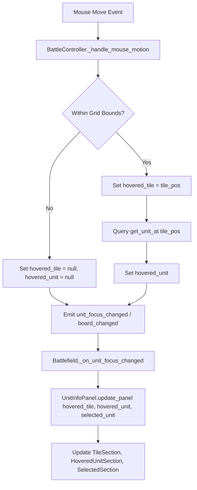

# Battle Map Tile Hover & Inspection Design

## 1. Overview & Objective

### Context
On the tactical battle grid, tiles can possess distinct tactical terrain properties such as **Cover** (indicated in-world by **"L"** for Low Cover and **"H"** for High Cover badges). Currently, the right-hand information panel (`UnitInfoPanel` in [`scripts/battle/unit_info_panel.gd`](../../scripts/battle/unit_info_panel.gd)) only updates when hovering directly over a `Unit`.

### Objective
Extend mouse hover detection on the battle map so that hovering over **any valid tile** displays tile information in the right-hand info panel:
* When hovering over an **empty tile**, the panel displays the tile's terrain and cover properties (e.g. **"High Cover"**, **"Low Cover"**, or **"Open Ground"**).
* When hovering over a **tile occupied by a unit**, the panel displays the tile's information alongside the hovered unit's details.
* The persistent **Selected Unit** section remains pinned at the bottom of the panel as before.

---

## 2. UI Layout & Wireframes

Adhering to [`UI-Layout-Design-Guidelines.md`](UI-Layout-Design-Guidelines.md), the right panel (`UnitInfoPanel`) uses container composition (`VBoxContainer` / `PanelContainer`) with clear hierarchy.

### Panel Container Hierarchy
```text
UnitInfoPanel (PanelContainer)
└── Content (VBoxContainer)
    ├── EmptyLabel (Label)                      # Visible only when mouse is off-grid & no unit selected
    ├── TileSection (VBoxContainer)             # Visible when hovering any valid grid tile
    │   ├── TileHeaderLabel (Label)             # e.g., "Terrain" or "Tile (3, 4)"
    │   └── TileCoverLabel (Label)              # e.g., "High Cover (+50% Missile Guard)"
    ├── HoveredUnitSection (VBoxContainer)      # Visible when a unit occupies the hovered tile (and != selected)
    │   ├── NameLabel / FacingLabel
    │   ├── HealthBar / WoundBadge / WoundLabel
    │   └── StatusLabel
    ├── Separator (HSeparator)                  # Visible when (Tile/HoveredUnit) AND SelectedUnit are active
    └── SelectedSection (VBoxContainer)         # Visible when a player unit is selected
        ├── NameLabel / FacingLabel / CoverLabel
        ├── ClassLabel / LevelLabel / HpLabel / HealthBar
        ├── ApLabel / WeaponLabel / DefenseLabel / StatusLabel
        └── ...
```

---

### UI States

#### State A: Hovering an Empty Tile with High Cover (Warrior Selected)
```text
+----------------------------+
| TERRAIN                    |
| High Cover (+50% Guard)    |
| [H] Dark Green Badge       |
|----------------------------|
| Warrior                    |
| Facing: East               |
| Cover: None                |
| HP: 10/10                  |
| [████████████████████]     |
| AP: 3/9                    |
| Weapon: Longsword          |
| Guard: 30% — Resist: 15%   |
+----------------------------+
```

#### State B: Hovering an Enemy Unit on Low Cover
```text
+----------------------------+
| TERRAIN                    |
| Low Cover (+25% Guard)     |
|----------------------------|
| Goblin Archer              |
| Facing: West               |
| Wounded [!]                |
| [██████████          ]     |
|----------------------------|
| Warrior                    |
| Facing: East               |
| HP: 10/10                  |
| AP: 3/9                    |
+----------------------------+
```

#### State C: Hovering Open Ground (No Unit Selected)
```text
+----------------------------+
| TERRAIN                    |
| Open Ground (No Cover)     |
+----------------------------+
```

#### State D: Mouse Off-Grid & No Selection
```text
+----------------------------+
| Hover over a tile or unit  |
| to see details.            |
+----------------------------+
```

---

## 3. Map Cursor & Visual Feedback

When the mouse moves across the battlefield:
1. **Tile Hover Cursor**:
   * A subtle tile highlight (translucent border/fill) renders on the currently hovered tile `hovered_tile`.
   * Stays visually distinct from the **Unit Hover Ring** (`HOVER_RING_COLOR`) and the **Unit Selection Ring** (`SELECTED_BORDER_COLOR`).
2. **Badge Consistency**:
   * In the right panel, tile cover uses text and visual badges matching the map's `"H"` and `"L"` markers (e.g. green pill badge or colored label) to preserve color-independent readability.

---

## 4. Technical Architecture & Data Flow



### Component Changes

1. **[`battle_controller.gd`](../../scripts/battle/battle_controller.gd)**:
   * Add property: `var hovered_tile: Variant = null` (stores `Vector2i` when hovering in-bounds, or `null`).
   * Update `_handle_mouse_motion(event: InputEventMouseMotion)`:
     ```gdscript
     var local_pos: Vector2 = make_input_local(event).position if is_inside_tree() else event.position
     var tile_pos := _to_grid_position(local_pos)
     if grid.is_in_bounds(tile_pos):
         _set_hovered_state(tile_pos, get_unit_at(tile_pos))
     else:
         _set_hovered_state(null, null)
     ```
   * Manage tile hover highlighting in `_update_highlights()`.

2. **[`grid.gd`](../../scripts/battle/grid.gd)**:
   * Helper query for tile terrain description:
     ```gdscript
     func get_tile_cover_description(tile: Vector2i) -> String:
         match get_cover(tile):
             COVER_HIGH:
                 return "high"
             COVER_LOW:
                 return "low"
             _:
                 return "none"
     ```

3. **[`unit_info_panel.gd`](../../scripts/battle/unit_info_panel.gd)**:
   * Update method signature: `update_panel(hovered_tile, hovered_unit, selected_unit) -> void`.
   * Add `_populate_tile_info(tile: Vector2i)`:
     * Reads `grid.grid.get_cover(tile)`.
     * Formats string:
       * `COVER_HIGH` $\rightarrow$ `tr("battle.tile_info.cover_high")` ("High Cover (+50% Missile Guard)").
       * `COVER_LOW` $\rightarrow$ `tr("battle.tile_info.cover_low")` ("Low Cover (+25% Missile Guard)").
       * `COVER_NONE` $\rightarrow$ `tr("battle.tile_info.cover_none")` ("Open Ground").
   * Manages visibility of `tile_section`, `hovered_section`, `selected_section`, and `empty_label`.

4. **Localization (`translations/en.tres`)**:
   * `"battle.unit_info.empty"`: `"Hover over a tile or unit to see details."`
   * `"battle.tile_info.header"`: `"Terrain"`
   * `"battle.tile_info.cover_high"`: `"High Cover (+50% Missile Guard)"`
   * `"battle.tile_info.cover_low"`: `"Low Cover (+25% Missile Guard)"`
   * `"battle.tile_info.cover_none"`: `"Open Ground"`

---

## 5. Extensibility & Future Terrain

This design establishes a clean interface for future terrain extensions without restructuring the panel:
* **Difficult / Rough Terrain**: Can display movement AP cost (e.g., "Mud: +1 AP to traverse").
* **Hazards / Elevation**: Can display hazard damage, height advantage, or line-of-sight obstruction.
* **Interactive Objects**: Chests, levers, or destructible barricades will populate the `TileSection` seamlessly.

---

## 6. Verification & Test Plan

1. **Unit Tests** ([`test_unit_info_panel.gd`](../../tests/unit/test_unit_info_panel.gd) & [`test_battle_controller.gd`](../../tests/unit/test_battle_controller.gd)):
   * Hovering over `Vector2i` with `COVER_HIGH` displays "High Cover".
   * Hovering over `Vector2i` with `COVER_LOW` displays "Low Cover".
   * Hovering over empty tile without cover displays "Open Ground".
   * Hovering over tile occupied by an enemy displays both tile info and enemy wound/facing details.
   * Moving cursor out of bounds clears `TileSection` and restores `EmptyLabel` (when no unit is selected).
2. **Manual Play Verification**:
   * Run `make play` and enter an encounter with cover (e.g., Goblin Camp).
   * Hover over green `"H"` and `"L"` badges and verify the right panel reflects the correct cover tier and guard bonus.
